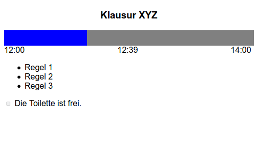

# exam.js

Eine minimale Webapp, die während einer schriftlichen Prüfung angezeigt werden kann.
Es gibt einen Fortschrittsbalken, der die verbleibende Zeit anzeigt, eine Liste von Regeln, sowie eine umschaltbare Checkbox, die anzeigt, ob die Toilette gerade belegt ist.
Die Details können einfach im Quellcode geändert werden.
Die App enthält nur HTML mit etwas eingebettetem CSS und Javascript ohne externe Abhängigkeiten.
Zum Anzeigen wird der Vollbildmodus im Browser sowie ein passender Zoomlevel empfohlen.

### Screenshot

